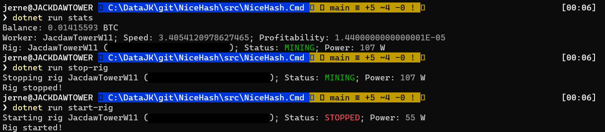

# NiceHash

With GPU prices rising and with no apparent end to be able to get a cost effective GPU for foreseeable future, using your existing GPU seems to be one of the few way how to patch the gap.

There a few goals for this project:
- Control NiceHash miner
- Get real-time power usage
- Get basic stats about the wallet/miner
- Allow controlling miner

One of the long term goals is to run the miner when the electric grid isn't at peak capacity to reduce the stress on electric grid.

This project is not a fork of official NiceHash GitHub repos and was written for .NET developers in mind.

# Usage

Atm, you can use `NiceHash.Cmd` to control it as command line or `NiceHash.Core` if you're more interested in using it directly in C#.
It will require .NET 6 SDK to compile the project. (you'll need Visual Studio 2022+, VS Code or Jetbrains Rider)

I'm also working on Elgato Stream Deck support so that I can control it faster.

## Console application

Duplicate `appsettings.json` as `appsettings.Local.json` and replace variables with API values from NiceHash portal to avoid accidental commits.

# Resources

- [Official NiceHash demo apps](https://github.com/nicehash/rest-clients-demo)
- [NiceHash documentation](https://www.nicehash.com/docs/rest)
